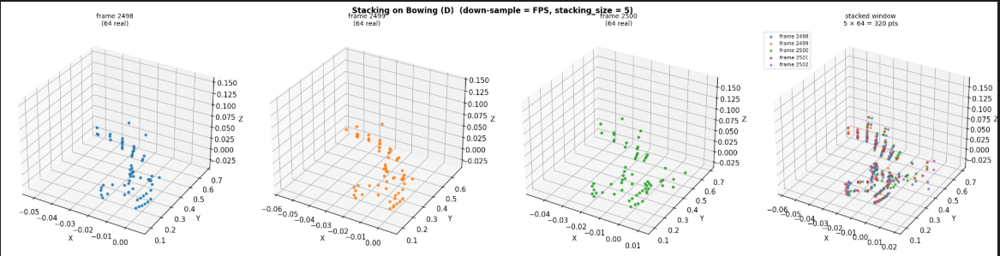
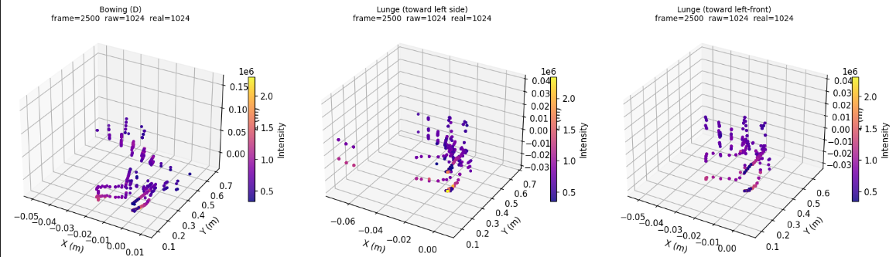

# mmWave Radar Human-Activity Dataset

A labelled mmWave radar point-cloud dataset for human-activity recognition, recorded with a TI AWR1843 / IWR6843 sensor.  
Each sample is a sequence of radar frames stored as NumPy arrays in `new_frames/<activity>/frames.npy`.

---

## Repository layout

```
├── explore_new_frames.ipynb   # exploration, visualisation, and H5 export notebook
├── radar_utils.py             # fps_sample and pad_or_crop helpers
└── README.md
```

The raw frame data is hosted separately on Google Drive (see **Data** below).

---

## Requirements

```
python >= 3.9
numpy
matplotlib
h5py          # only needed for H5 export (Section 6 of the notebook)
```

Install with:

```bash
pip install numpy matplotlib h5py
```

---

## Data

The dataset is hosted on Google Drive as a single ZIP file.

**Download link:** _[link will be added upon public release]_

### Setup steps

**1. Download** `new_frames.zip` from the link above.

**2. Unzip** it into the same folder as the notebook:

```bash
unzip new_frames.zip
```

After unzipping, the folder structure should look like this:

```
your_folder/
├── explore_new_frames.ipynb
├── radar_utils.py
├── README.md
└── new_frames/
    ├── walk/
    │   └── frames.npy
    ├── run/
    │   └── frames.npy
    ├── sit/
    │   └── frames.npy
    └── ...
```

**3. Open** `explore_new_frames.ipynb` in Jupyter and follow the instructions in the next section.

---

## Using the notebook

### Step 1 — Set your configuration (Cell 1)

The very first code cell contains all the settings you need to adjust. Open it and edit the values to match your needs:

```python
NEW_FRAMES_DIR = "new_frames"   # path to the unzipped data folder
                                 # use an absolute path if the folder is elsewhere,
                                 # e.g. "/home/user/data/new_frames"

N_POINTS       = 64             # number of points per frame after down-sampling
                                 # lower = faster, higher = more spatial detail
                                 # typical values: 32, 64, 128, 256

STACKING_SIZE  = 5              # how many consecutive frames are stacked into
                                 # one training sample (temporal context window)
                                 # set to 1 to disable stacking

STRIDE         = None           # sliding-window stride for stacking
                                 # None  → no overlap (stride = STACKING_SIZE)
                                 # 1     → maximum overlap (one frame shift)
                                 # any integer between 1 and STACKING_SIZE

USE_FPS        = True           # down-sampling method:
                                 # True  → Farthest Point Sampling (better spatial
                                 #         coverage, recommended for training)
                                 # False → intensity crop / zero-pad (much faster,
                                 #         good for quick exploration)

H5_FEATURES    = "x,y,z,intensity,speed"   # feature names — do not change unless
                                             # your frames.npy has a different layout
```

### Step 2 — Run the exploration cells

Cells 1–5 give you:
- A summary table of all activities (frame counts, file sizes).
- Per-feature statistics (min, max, mean, std) over all real points.
- 3-D scatter plots — one frame per activity, coloured by intensity.
- A side-by-side comparison of `pad_or_crop` vs `fps_sample` on the same frame.
- Per-activity window counts for different stride values.

**Example — FPS down-sampling and frame stacking (Cell 4 & 5 output):**



### Step 3 — (Optional) Export to H5

**Cell 6** packages everything into a single `.h5` file ready for model training.  
Before running it, set these three extra variables at the top of that cell:

```python
H5_OUT_PATH = "dataset.h5"        # where to save the output file
H5_SPLIT    = (0.75, 0.05, 0.20)  # train / val / test split fractions
H5_SEED     = 42                   # random seed (for reproducibility)
```

Then run Cell 6. It will:
1. Slide a window of `STACKING_SIZE` frames (with the chosen `STRIDE`) over every activity.
2. Down-sample each frame to `N_POINTS` using the method set in Cell 1.
3. Stack frames into samples of shape `(STACKING_SIZE × N_POINTS, 5)`.
4. Randomly assign each sample to train / val / test.
5. Save everything as a compressed `.h5` file.

The output H5 schema is:

```
/points      float32  (N_samples, STACKING_SIZE × N_POINTS, 5)
/class_id    int32    (N_samples,)
/sample_id   int32    (N_samples,)
/class_name  bytes    (N_samples,)
/split       bytes    (N_samples,)    "train" | "val" | "test"
```

---

## Data format

Each `frames.npy` array has shape `(F, N, 5)` where:

| Axis | Meaning |
|------|---------|
| `F`  | Number of radar frames for this activity |
| `N`  | Raw points per frame (variable density; zero-rows = no reflection) |
| `5`  | Feature columns: **x, y, z** (metres), **intensity**, **Doppler speed** (m/s) |

Real points have `intensity > 0`; zero-padded rows have all columns equal to 0.

**Example — raw point-cloud samples (one frame per activity):**



---

## Utility functions (`radar_utils.py`)

### `fps_sample(points, n, seed=0)`
Farthest Point Sampling — selects `n` geometrically spread points from a `(N, 5)` frame.  
Guarantees good spatial coverage; recommended for model training.

### `pad_or_crop(points, n)`
Fast alternative — keeps the `n` highest-intensity points, or zero-pads if the frame is sparse.  
Roughly 10–50× faster than FPS; useful for quick data inspection.

Both functions accept `(N, 5) float32` arrays and return exactly `(n, 5) float32`.

```python
from radar_utils import fps_sample, pad_or_crop

frame_ds = fps_sample(frame, n=64)   # (64, 5)
```

---

## Activities

| Label | Description |
|-------|-------------|
| _(list your activity classes here)_ | |

---

## Sensor configuration

| Parameter | Value |
|-----------|-------|
| Sensor | TI AWR1843 / IWR6843 |
| Carrier frequency | 60 GHz |
| Range resolution | _(fill in)_ |
| Velocity resolution | _(fill in)_ |
| Frame rate | _(fill in)_ fps |
| Subjects | _(fill in)_ |

---

## Citation

If you use this dataset in your research, please cite:

```bibtex
@article{your_paper_doi,
  title   = {[Paper title to be added]},
  author  = {[Authors]},
  journal = {[Venue]},
  year    = {[Year]},
  doi     = {[DOI — to be added upon publication]}
}
```

> **DOI will be added here once the paper is published.**  
> In the meantime, please cite this repository directly.

---

## License

_(Choose a license — e.g. CC BY 4.0 for data, MIT for code)_

---

## Contact

For questions or issues, please open a GitHub Issue or contact _(your email / lab page)_.